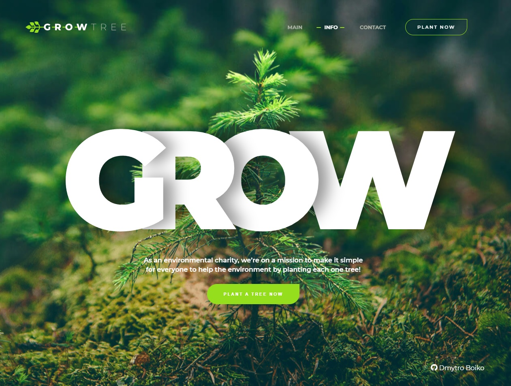

# Landing page for Museum

## Description

Developed a responsive one page website using HTML, CSS, JS. The site is adapted for various devices, including mobile and tablets.

Smooth transitions, interactive elements, smooth navigation were implemented. The project was implemented according to the BEM methodology, providing clean and structured code (for the convenience of further support by developers). The layout is cross-browser, tested in popular browsers.

Technologies that have been used

- HTML5
- CSS3
- BEM
- JS
- SWIPER
- GIT
- FIGMA

## View project

> Link to the project
> [DEMO LINK](https://boikoua.github.io/grow-tree/).

## Preview

